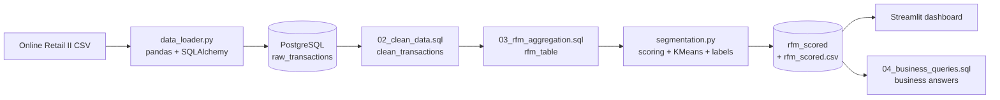

# Customer Segmentation using RFM Analysis

End-to-end customer segmentation pipeline: **PostgreSQL + SQL (CTEs, window functions) + Python (KMeans) + Streamlit dashboard**, built on 1M+ retail transaction lines to show a business *who its best customers are, who is slipping away, and where marketing budget is being wasted.*

**Headline result:** 18.5% of customers (Champions) generate ~71% of revenue, and a further 25.5% (At Risk) hold £3.2M of historical revenue but have not bought for ~7 months.

---

## Table of Contents
1. [Problem Statement](#problem-statement)
2. [Business Questions Answered](#business-questions-answered)
3. [Solution Overview](#solution-overview)
4. [Methodology](#methodology)
5. [Segments & Recommended Actions](#segments--recommended-actions)
6. [Key Results](#key-results)
7. [Business Benefits](#business-benefits)
8. [Tech Stack](#tech-stack)
9. [Project Structure](#project-structure)
10. [Installation & Setup](#installation--setup)
11. [SQL Layer](#sql-layer)
12. [Dashboard](#dashboard)
13. [Deployment](#deployment)
14. [Lessons Learned](#lessons-learned)
15. [Limitations & Future Work](#limitations--future-work)
16. [Author](#author)

---

## Problem Statement

An online retailer treats every customer the same in its marketing. In reality:

- a **small share of customers drives most of the revenue**,
- some high-value customers are **quietly disengaging** and will churn if nobody notices,
- a large share of customers is **already inactive**, so spending on them is wasted.

Without segmentation the business cannot tell these groups apart, so retention effort is spread thin and revenue leaks.

**Goal:** group customers by purchasing behaviour using **RFM** and turn the result into clear actions per group.

| Metric | Meaning | Good customer has |
|---|---|---|
| **R**ecency | Days since last purchase | Low value |
| **F**requency | Number of distinct orders | High value |
| **M**onetary | Total amount spent | High value |

**Dataset:** [Online Retail II (UCI)](https://archive.ics.uci.edu/dataset/502/online+retail+ii): invoice-level transactions of a UK-based online gift retailer, 2009 to 2011, customers in ~40 countries.

---

## Business Questions Answered

Every question below is answered with a SQL query in [`sql/04_business_queries.sql`](sql/04_business_queries.sql) and/or the dashboard.

| # | Business question | How it is answered | Decision it supports |
|---|---|---|---|
| Q1 | What % of customers generate what % of revenue? | Decile analysis with `NTILE` + cumulative `SUM() OVER` | Where to focus retention budget |
| Q2 | How big is each segment and what is it worth? | Segment-level `COUNT`, revenue share via window functions | Prioritising segments |
| Q3 | How much revenue is at risk of churning? | Revenue of the *At Risk* segment, with 15% / 20% win-back scenarios | Sizing a win-back campaign |
| Q4 | After how many days of inactivity should we trigger an alert? | Recency percentiles (`PERCENTILE_CONT`) per segment | Automated re-engagement trigger |
| Q5 | Is the business retail or wholesale driven? | Revenue share by order-frequency bucket | How to report "typical customer value" |
| Q6 | Are there geographic concentrations? | Revenue by country from cleaned transactions | Regional marketing priorities |
| Q7 | Which at-risk customers should we contact first? | Top *At Risk* customers ranked by lifetime spend | A ready-to-use call/email list |

---

## Solution Overview



---

## Methodology

**1. Ingestion.** The raw CSV is loaded into PostgreSQL (`raw_transactions`) in chunks of 5,000 rows.

**2. Cleaning (SQL).** Rows are removed when they cannot describe real customer purchasing:

| Rule | Why |
|---|---|
| `Customer ID IS NOT NULL` | Guest orders cannot be attributed to a customer |
| `Quantity > 0` | Negative quantities are returns |
| `Price > 0` | Zero/negative prices are adjustments and write-offs |
| `Invoice NOT LIKE 'C%'` | `C` prefix marks cancelled invoices |

**3. RFM aggregation (SQL CTEs).** One row per customer: recency measured against the **last date in the data** (not today's date), frequency as `COUNT(DISTINCT invoice_no)`, monetary as `SUM(quantity * unit_price)`.

**4. Scoring.** Each metric is scored 1 to 5 with quintiles. Ranking is applied before `qcut` because frequency and monetary have many repeated values, which otherwise causes "Bin edges must be unique" errors.

**5. Clustering.** Spend and order counts are heavily skewed (a few wholesale-style accounts spend hundreds of thousands), so R, F and M are first **log-transformed (`log1p`)** and then standardised (`StandardScaler`). KMeans is run for k = 3 to 6; **k is chosen by silhouette score**, and any k that creates a cluster under 2% of customers is rejected.

**6. Behaviour-based labelling.** Each cluster is named from its **average 1 to 5 R, F and M scores**, with recency checked first:

| Rule (cluster averages) | Label |
|---|---|
| Recent (R ≥ 3.5), F ≥ 4 and M ≥ 4 | Champions |
| Recent, good F/M | Loyal Customers |
| Recent, low F/M | Potential Loyalists |
| Gone quiet (R < 3), good F/M | At Risk |
| Gone quiet, low F/M | Lost / Churned |

The script also prints a warning if two clusters share a label or no At Risk cluster exists.

---

## Segments & Recommended Actions

| Segment | Behaviour (cluster averages) | Recommended action |
|---|---|---|
| **Champions** | Bought ~24 days ago, ~20 orders, ~£11.5K spend | Loyalty programme, early access, referral rewards. Retain, don't discount |
| **Potential Loyalists** | Bought ~27 days ago, ~3 orders, ~£843 | Nudge to a second and third order; cross-sell |
| **At Risk** | Last bought ~204 days ago, ~5.5 orders, ~£2.1K | Targeted win-back email / offer before they churn |
| **Lost / Churned** | Last bought ~391 days ago, ~1.4 orders, ~£345 | Stop broad marketing spend; low-cost reactivation at most |

---

## Key Results

5,878 customers profiled from 1M+ raw invoice lines. Total revenue in the cleaned data is about £17.4M.

**Revenue concentration (Q1)**

| Customers (by spend) | Share of revenue |
|---|---|
| Top 10% | 63.9% |
| Top 20% | 77.2% |
| Top 30% | 85.0% |

**Segments (Q2)**

| Segment | Customers | % of customers | ~% of revenue* |
|---|---|---|---|
| Champions | 1,085 | 18.5% | ~71.5% |
| At Risk | 1,496 | 25.5% | 18.5% |
| Potential Loyalists | 1,214 | 20.7% | ~5.9% |
| Lost / Churned | 2,083 | 35.4% | ~4.1% |

\*Derived from customers x average spend; confirm against the `pct_of_revenue` column of Q2.

**At Risk opportunity (Q3)**
- 1,496 customers holding **£3,209,444** of historical revenue (18.5% of total).
- At an assumed 15% win-back rate: about **£481K**. At 20%: about **£642K**. These rates are planning assumptions, not measured values.

**Churn trigger (Q4)**
- At Risk customers' recency starts at 20 days and their 25th percentile is 76 days; Lost / Churned customers' 25th percentile is 244 days.
- Suggested re-engagement trigger: no purchase for **[N] days** (take this from the At Risk median / p75 in Q4).

**Geography (Q6)**
- The UK is dominant: 5,350 customers and £14.4M revenue, about 83% of total.
- Next: EIRE (£617K, 5 customers) and the Netherlands (£554K, 22 customers).
- Top 3 countries together are about 90% of revenue.

**Retail vs wholesale (Q5):** [fill in from your Q5 output: share of revenue from customers with 10+ orders].

---

## Business Benefits

- **Retention over acquisition:** under a fifth of customers produce about 70% of revenue, so budget should shift towards protecting them.
- **Early churn warning:** £3.2M of historical revenue sits in a group that has gone quiet but still has good order history, and the recency data gives a threshold to automate alerts.
- **Less wasted spend:** the Lost / Churned group is 35% of customers but only about 4% of revenue, so generic campaigns can skip it.
- **Actionable output:** every customer carries a segment label, exportable as CSV for CRM or email tools, and Q7 produces a ranked win-back call list.
- **Repeatable:** the whole pipeline re-runs from the raw file, so it can be refreshed monthly.

---

## Tech Stack

| Layer | Tool |
|---|---|
| Storage | PostgreSQL |
| Ingestion | pandas, SQLAlchemy, psycopg2 |
| Transformation | SQL (CTEs, window functions, `PERCENTILE_CONT`) |
| Modelling | scikit-learn (`StandardScaler`, `KMeans`, silhouette score) |
| EDA | Jupyter, matplotlib, seaborn |
| Dashboard | Streamlit |
| Deployment | AWS EC2 + systemd |
| Config / secrets | python-dotenv |

---

## Project Structure

```
customer-segmentation-using-rfm-analysis/
├── data/
│   ├── raw/                      
│   └── processed/                
├── sql/
│   ├── 01_schema.sql             
│   ├── 02_clean_data.sql         
│   ├── 03_rfm_aggregation.sql    
│   └── 04_business_queries.sql   
├── src/
│   ├── db_connection.py          
│   ├── data_loader.py            
│   ├── segmentation.py           
│   └── utils.py
├── app/
│   └── streamlit_app.py          
├── notebooks
│   ├── eda.ipynb
│   └── EDA_REPORT.md
├── deployment/
│   └── ec2_setup_notes.md
├── .env.example
├── .gitignore
├── requirements.txt
└── README.md
```

---

## Installation & Setup

### Prerequisites
- Python 3.10+
- PostgreSQL 13+ running locally (or a hosted instance)
- Git

### 1. Clone and create environment
```bash
git clone https://github.com/YOUR_USERNAME/customer-segmentation-using-rfm-analysis.git
cd customer-segmentation-using-rfm-analysis
python -m venv venv

# Windows
venv\Scripts\activate
# macOS / Linux
source venv/bin/activate

pip install -r requirements.txt
```

### 2. Configure database credentials
```bash
cp .env.example .env
```
Edit `.env`:
```
DB_USER=postgres
DB_PASSWORD=your_password
DB_HOST=localhost
DB_NAME=rfm_db
```
> `.env` is git-ignored. Never commit real credentials.

### 3. Create the database
```sql
CREATE DATABASE rfm_db;
```

### 4. Download the data
Download **Online Retail II** from the [UCI repository](https://archive.ics.uci.edu/dataset/502/online+retail+ii). If you get an Excel file, export it to CSV and save it as:
```
data/raw/online_retail_II.csv
```

### 5. Load raw data into PostgreSQL
```bash
cd src
python data_loader.py
```

### 6. Clean and aggregate with SQL
```bash
psql -U postgres -d rfm_db -f ../sql/02_clean_data.sql
psql -U postgres -d rfm_db -f ../sql/03_rfm_aggregation.sql
```

### 7. Score and cluster customers
```bash
python segmentation.py
```
Writes the `rfm_scored` table and `data/processed/rfm_scored.csv`, and prints the silhouette score per k and each segment's profile.

### 8. Answer the business questions
```bash
cd ..
psql -U postgres -d rfm_db -f sql/04_business_queries.sql
```
Re-run this after every re-clustering, because Q2, Q3, Q4 and Q7 depend on the segment labels.

### 9. Launch the dashboard (from the project root)
```bash
streamlit run app/streamlit_app.py
```
Open `http://localhost:8501`.

### Troubleshooting
| Problem | Fix |
|---|---|
| `Missing required .env values` | Copy `.env.example` to `.env` and fill all four values |
| `column "Customer ID" does not exist` | Column names differ by export; check with `SELECT * FROM raw_transactions LIMIT 5;` |
| `Could not find data/processed/rfm_scored.csv` | Run `python src/segmentation.py` first |
| Rows dropped is far above ~30% | Check column-name mapping in `02_clean_data.sql` |
| Q3 returns 0 customers / Q7 returns no data | No cluster is labelled "At Risk"; read the profile table printed by `segmentation.py` |

---

## SQL Layer

| File | Purpose | Techniques |
|---|---|---|
| `01_schema.sql` | Documents the raw table shape | Reference only |
| `02_clean_data.sql` | Filters invalid rows, standardises column names to `snake_case` and types | `CREATE TABLE AS`, casting |
| `03_rfm_aggregation.sql` | Builds one row per customer with R, F, M | CTEs, `GROUP BY`, date arithmetic |
| `04_business_queries.sql` | Answers Q1 to Q7 | `NTILE`, `SUM() OVER`, `PERCENTILE_CONT`, `CASE`, `COALESCE` |

Example, revenue concentration by customer decile:
```sql
WITH ranked AS (
    SELECT customer_id, monetary::numeric AS monetary,
           NTILE(10) OVER (ORDER BY monetary DESC) AS decile
    FROM rfm_scored
)
SELECT decile,
       ROUND(100.0 * SUM(monetary) / SUM(SUM(monetary)) OVER (), 1) AS pct_of_revenue
FROM ranked
GROUP BY decile
ORDER BY decile;
```

---

## Dashboard

The Streamlit app reads `data/processed/rfm_scored.csv` and shows:

- KPI cards: total customers, total revenue, share of revenue from the top 10% of customers
- Customers per segment and revenue per segment
- Segment profile table (average recency, frequency, monetary)
- **Customer lookup** by ID to see any customer's RFM values and segment

Live demo: `https://customer-segmentation-rfm-mb.streamlit.app/`

---

## Deployment

Deployed on an AWS EC2 `t2.micro` (Ubuntu 22.04) and kept running with a `systemd` service that restarts on crash or reboot. Full steps are in [`deployment/ec2_setup_notes.md`](deployment/ec2_setup_notes.md).

Because the dashboard reads the processed CSV, the server does not need a live database connection.

---

## Lessons Learned

1. **Raw KMeans on skewed data gives useless clusters.** The first run produced clusters of 4 and 38 customers because a handful of wholesale-style accounts dominate spend. A `log1p` transform and a minimum-cluster-size rule gave four balanced segments (1,085 to 2,083 customers each).
2. **Labels must follow behaviour, not rank order.** The first labelling code handed out names by cluster rank, so an active group (bought ~66 days ago, 7 orders) was called "At Risk". Labels are now assigned from each cluster's R/F/M averages, with recency checked first.
3. **Sanity-check labels against the profile table.** A cluster with R = 2.6 was briefly labelled "Loyal" because of a loose threshold; the downstream query Q3 returned zero rows, which exposed the bug. The script now warns when no At Risk cluster exists.

---

## Limitations & Future Work

**Limitations**
- RFM weights the three metrics equally and ignores product category and seasonality.
- KMeans clusters are fuzzy: the minimum recency of the At Risk group is 20 days, so a single day-count cannot cleanly separate segments. The churn trigger comes from recency percentiles, not a hard cluster boundary.
- The label thresholds (R ≥ 3.5, F/M ≥ 4, and so on) are judgement calls and should be reviewed after every re-run.
- Win-back rates of 15% and 20% are assumptions, not measured values.
- Revenue is concentrated: Champions produce ~71% of revenue and the UK ~83%, so results depend heavily on a few customers and one market.
- The data covers 2009 to 2011 and one UK retailer, so thresholds should be re-validated on current data before real use.

**Future work**
- Monthly re-runs to track customers moving between segments
- Power BI / Tableau version of the dashboard
- Dockerise the pipeline
- CLV prediction and churn probability model on top of RFM
- Measure real win-back rates with an A/B test instead of assumed ones

---

## Author

**Mariya Babu**
B.Tech, Information Technology, KKR & KSR Institute of Technology and Sciences
[LinkedIn](https://www.linkedin.com/in/mariya-babu-854331257)
