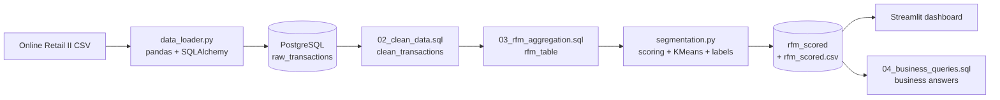

# Customer Segmentation using RFM Analysis

End-to-end customer segmentation pipeline: **PostgreSQL + SQL (CTEs, window functions) + Python (KMeans) + Streamlit dashboard**, built on 1M+ retail transaction lines to show a business *who its best customers are, who is slipping away, and where marketing budget is being wasted.*

---

## Table of Contents
1. [Problem Statement](#problem-statement)
2. [Business Questions Answered](#business-questions-answered)
3. [Solution Overview](#solution-overview)
4. [Methodology](#methodology)
5. [Segments & Recommended Actions](#segments--recommended-actions)
6. [Business Benefits](#business-benefits)
7. [Key Results](#key-results)
8. [Tech Stack](#tech-stack)
9. [Project Structure](#project-structure)
10. [Installation & Setup](#installation--setup)
11. [SQL Layer](#sql-layer)
12. [Dashboard](#dashboard)
13. [Deployment](#deployment)
14. [Limitations & Future Work](#limitations--future-work)
15. [Author](#author)

---

## Problem Statement

An online retailer treats every customer the same in its marketing. In reality:

- a **small share of customers drives most of the revenue**,
- some high-value customers are **quietly disengaging** and will churn if nobody notices,
- a large share of customers is **already inactive**, so spending on them is wasted.

Without segmentation the business cannot tell these groups apart, so retention effort is spread thin and revenue leaks.

**Goal:** group customers by purchasing behaviour using **RFM** and turn the result into clear actions per group.

| Metric | Meaning | Good customer has |
|---|---|---|
| **R**ecency | Days since last purchase | Low value |
| **F**requency | Number of distinct orders | High value |
| **M**onetary | Total amount spent | High value |

**Dataset:** [Online Retail II (UCI)](https://archive.ics.uci.edu/dataset/502/online+retail+ii): invoice-level transactions of a UK-based online gift retailer, 2009 to 2011, customers in ~40 countries.

---

## Business Questions Answered

Every question below is answered with a SQL query in [`sql/04_business_queries.sql`](sql/04_business_queries.sql) and/or the dashboard.

| # | Business question | How it is answered | Decision it supports |
|---|---|---|---|
| Q1 | What % of customers generate what % of revenue? | Decile analysis with `NTILE` + cumulative `SUM() OVER` | Where to focus retention budget |
| Q2 | How big is each segment and what is it worth? | Segment-level `COUNT`, revenue share via window functions | Prioritising segments |
| Q3 | How much revenue is at risk of churning? | Revenue of the *At Risk* segment, with 15% / 20% win-back scenarios | Sizing a win-back campaign |
| Q4 | After how many days of inactivity should we trigger an alert? | Recency percentiles (`PERCENTILE_CONT`) per segment | Automated re-engagement trigger |
| Q5 | Is the business retail or wholesale driven? | Revenue share by order-frequency bucket | How to report "typical customer value" |
| Q6 | Are there geographic concentrations? | Revenue by country from cleaned transactions | Regional marketing priorities |
| Q7 | Which at-risk customers should we contact first? | Top *At Risk* customers ranked by lifetime spend | A ready-to-use call/email list |

---

## Solution Overview



---

## Methodology

**1. Ingestion.** The raw CSV is loaded into PostgreSQL (`raw_transactions`) in chunks of 5,000 rows.

**2. Cleaning (SQL).** Rows are removed when they cannot describe real customer purchasing:

| Rule | Why |
|---|---|
| `Customer ID IS NOT NULL` | Guest orders cannot be attributed to a customer |
| `Quantity > 0` | Negative quantities are returns |
| `Price > 0` | Zero/negative prices are adjustments and write-offs |
| `Invoice NOT LIKE 'C%'` | `C` prefix marks cancelled invoices |

**3. RFM aggregation (SQL CTEs).** One row per customer: recency measured against the **last date in the data** (not today's date), frequency as `COUNT(DISTINCT invoice_no)`, monetary as `SUM(quantity * unit_price)`.

**4. Scoring.** Each metric is scored 1 to 5 with quintiles. Ranking is applied before `qcut` because frequency and monetary have many repeated values, which otherwise causes "Bin edges must be unique" errors.

**5. Clustering.** R, F and M are standardised (`StandardScaler`) so monetary does not dominate the distance calculation, then clustered with **KMeans (k = 4, `random_state=42`)**.

**6. Automatic labelling.** Clusters are ranked on recency, frequency and monetary and combined into a composite rank, then named best to worst. This removes the need to hand-map cluster IDs to names, which changes between runs.

---

## Segments & Recommended Actions

| Segment | Behaviour | Recommended action |
|---|---|---|
| **Champions** | Bought recently, order often, highest spend | Loyalty programme, early access, referral rewards. Retain, don't discount |
| **Loyal Customers** | Regular buyers, moderate spend | Upsell and cross-sell, nudge towards Champion behaviour |
| **At Risk** | Were valuable, but have gone quiet | Targeted win-back email / offer before they churn |
| **Lost / Churned** | Long inactive, low activity | Stop broad marketing spend; low-cost reactivation at most |

---

## Business Benefits

- **Retention over acquisition:** shows how concentrated revenue is, so budget can move towards protecting top customers.
- **Early churn warning:** quantifies revenue sitting in the At Risk group and gives a recency threshold to automate alerts.
- **Less wasted spend:** identifies customers who no longer respond so generic campaigns can skip them.
- **Actionable output:** every customer carries a segment label, exportable as CSV for CRM or email tools.
- **Repeatable:** the whole pipeline re-runs from the raw file, so it can be refreshed monthly.

---

## Key Results

> Run [`sql/04_business_queries.sql`](sql/04_business_queries.sql) after the pipeline and fill in the values below from your own output.

- **Scale:** 1M+ raw invoice lines reduced to a cleaned set of **5,878 customers** profiled.
- Top 10% of customers generate **_XX_%** of total revenue (Q1).
- Champions + Loyal customers are **_XX_%** of customers but **_XX_%** of revenue (Q2).
- At Risk segment holds **_£X_** in historical revenue; a 15% win-back is worth **_£Y_** (Q3).
- Suggested re-engagement trigger: no purchase for **_N_** days (Q4).
- Top-3 countries account for **_XX_%** of revenue (Q6).

---

## Tech Stack

| Layer | Tool |
|---|---|
| Storage | PostgreSQL |
| Ingestion | pandas, SQLAlchemy, psycopg2 |
| Transformation | SQL (CTEs, window functions, `PERCENTILE_CONT`) |
| Modelling | scikit-learn (`StandardScaler`, `KMeans`, silhouette score) |
| EDA | Jupyter, matplotlib, seaborn |
| Dashboard | Streamlit |
| Deployment | AWS EC2 + systemd |
| Config / secrets | python-dotenv |

---

## Project Structure

```
customer-segmentation-using-rfm-analysis/
├── data/
│   ├── raw/                      # original CSV (not pushed to GitHub)
│   └── processed/                # rfm_scored.csv output
├── sql/
│   ├── 01_schema.sql             # reference: expected raw table shape
│   ├── 02_clean_data.sql         # raw -> clean_transactions
│   ├── 03_rfm_aggregation.sql    # clean -> rfm_table
│   └── 04_business_queries.sql   # business questions Q1-Q7
├── src/
│   ├── db_connection.py          # SQLAlchemy engine from .env
│   ├── data_loader.py            # CSV -> raw_transactions
│   ├── segmentation.py           # scoring + KMeans + labelling
│   └── utils.py                  # shared helpers
├── app/
│   └── streamlit_app.py          # dashboard
├── notebooks/
│   ├── eda.ipynb                 # full EDA + choosing k
│   └── EDA_REPORT.md             # problem statement & conclusions write-up
├── deployment/
│   └── ec2_setup_notes.md
├── .env.example
├── .gitignore
├── requirements.txt
└── README.md
```

---

## Installation & Setup

### Prerequisites
- Python 3.10+
- PostgreSQL 13+ running locally (or a hosted instance)
- Git

### 1. Clone and create environment
```bash
git clone https://github.com/YOUR_USERNAME/customer-segmentation-using-rfm-analysis.git
cd customer-segmentation-using-rfm-analysis
python -m venv venv

# Windows
venv\Scripts\activate
# macOS / Linux
source venv/bin/activate

pip install -r requirements.txt
```

### 2. Configure database credentials
```bash
cp .env.example .env
```
Edit `.env`:
```
DB_USER=postgres
DB_PASSWORD=your_password
DB_HOST=localhost
DB_NAME=rfm_db
```
> `.env` is git-ignored. Never commit real credentials.

### 3. Create the database
```sql
CREATE DATABASE rfm_db;
```

### 4. Download the data
Download **Online Retail II** from the [UCI repository](https://archive.ics.uci.edu/dataset/502/online+retail+ii). If you get an Excel file, export it to CSV and save it as:
```
data/raw/online_retail_II.csv
```

### 5. Load raw data into PostgreSQL
```bash
cd src
python data_loader.py
```

### 6. Clean and aggregate with SQL
```bash
psql -U postgres -d rfm_db -f ../sql/02_clean_data.sql
psql -U postgres -d rfm_db -f ../sql/03_rfm_aggregation.sql
```

### 7. Score and cluster customers
```bash
python segmentation.py
```
Writes the `rfm_scored` table and `data/processed/rfm_scored.csv`, and prints each segment's profile.

### 8. Answer the business questions (optional)
```bash
cd ..
psql -U postgres -d rfm_db -f sql/04_business_queries.sql
```

### 9. Launch the dashboard (from the project root)
```bash
streamlit run app/streamlit_app.py
```
Open `http://localhost:8501`.

### Troubleshooting
| Problem | Fix |
|---|---|
| `Missing required .env values` | Copy `.env.example` to `.env` and fill all four values |
| `column "Customer ID" does not exist` | Column names differ by export; check with `SELECT * FROM raw_transactions LIMIT 5;` |
| `Could not find data/processed/rfm_scored.csv` | Run `python src/segmentation.py` first |
| Rows dropped is far above ~30% | Check column-name mapping in `02_clean_data.sql` |

---

## SQL Layer

| File | Purpose | Techniques |
|---|---|---|
| `01_schema.sql` | Documents the raw table shape | Reference only |
| `02_clean_data.sql` | Filters invalid rows, standardises column names to `snake_case` and types | `CREATE TABLE AS`, casting |
| `03_rfm_aggregation.sql` | Builds one row per customer with R, F, M | CTEs, `GROUP BY`, date arithmetic |
| `04_business_queries.sql` | Answers Q1 to Q7 | `NTILE`, `SUM() OVER`, `PERCENTILE_CONT`, `CASE` |

Example, revenue concentration by customer decile:
```sql
WITH ranked AS (
    SELECT customer_id, monetary::numeric AS monetary,
           NTILE(10) OVER (ORDER BY monetary DESC) AS decile
    FROM rfm_scored
)
SELECT decile,
       ROUND(100.0 * SUM(monetary) / SUM(SUM(monetary)) OVER (), 1) AS pct_of_revenue
FROM ranked
GROUP BY decile
ORDER BY decile;
```

---

## Dashboard

The Streamlit app reads `data/processed/rfm_scored.csv` and shows:

- KPI cards: total customers, total revenue, share of revenue from the top 10% of customers
- Customers per segment and revenue per segment
- Segment profile table (average recency, frequency, monetary)
- **Customer lookup** by ID to see any customer's RFM values and segment

Live demo: `https://customer-segmentation-rfm-mb.streamlit.app/`

---

## Deployment

Deployed on an AWS EC2 `t2.micro` (Ubuntu 22.04) and kept running with a `systemd` service that restarts on crash or reboot. Full steps are in [`deployment/ec2_setup_notes.md`](deployment/ec2_setup_notes.md).

Because the dashboard reads the processed CSV, the server does not need a live database connection.

---

## Limitations & Future Work

**Limitations**
- RFM weights the three metrics equally and ignores product category and seasonality.
- KMeans is sensitive to `k` and outliers; `notebooks/eda.ipynb` uses elbow and silhouette scores to justify the choice of `k`.
- The data covers 2009 to 2011 and one UK retailer, so thresholds should be re-validated on current data before real use.

**Future work**
- Monthly re-runs to track customers moving between segments
- Power BI / Tableau version of the dashboard
- Dockerise the pipeline
- CLV prediction and churn probability model on top of RFM

---

## Author

**Mariya Babu**
B.Tech, Information Technology, KKR & KSR Institute of Technology and Sciences
[LinkedIn](https://www.linkedin.com/in/mariya-babu-854331257)
